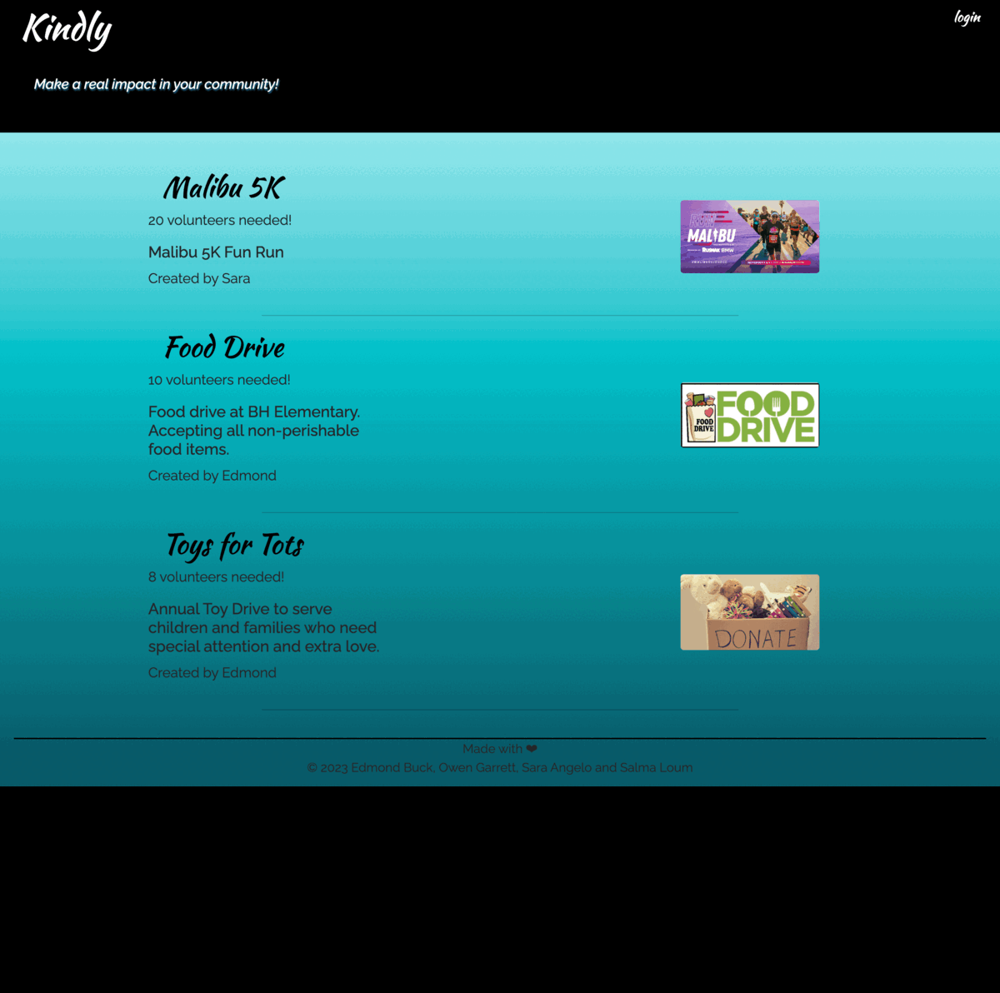

# kindly

## Description

Kindly is a full-stack application where volunteer users can create an account, log in, submit available volunteer opportunities, photos, which are then posted to the homepage. Users can also comment on these posts.

## Table of Contents (Optional)

- [Installation](#installation)
- [Usage](#usage)
- [Credits](#credits)
- [License](#license)
- [Features](#features)
- [How to Contribute](#how-to-contribute)
- [Tests](#tests)
- [Questions](#questions)

## Installation

Go to [app page](https:) and follow the prompts.

## Usage

## Credits

<!-- include everyone's github username -->

### Developers:

- [Edmond Buck](https://github.com/Eddiebuck88)
- [Owen Garrett](https://github.com/Sheogorath9)
- [Salma Loum](https://github.com/SalmaLoum)
- [Sara Angelo](https://github.com/saramangelo)

### Applications used:

- [Bootstrap](https://getbootstrap.com/)
- [Cloudinary](https://cloudinary.com/documentation/upload_widget)
- [Google Fonts](https://fonts.google.com/about)
- [Heroku](https://dashboard.heroku.com/)
- [My SQL Workbench](https://www.mysql.com/products/workbench/)
- [UCLA Extension Bootcamp](https://www.uclaextension.edu/?gclid=Cj0KCQiAgribBhDkARIsAASA5btdbwAz8x25r3b1deoRNIGxfkPFL11rAQMuCgQ7HYiqBH8CLr9CgLoaAktlEALw_wcB&gclsrc=aw.ds)

## License

MIT License

Copyright (c) 2023

Permission is hereby granted, free of charge, to any person obtaining a copy
of this software and associated documentation files (the "Software"), to deal
in the Software without restriction, including without limitation the rights
to use, copy, modify, merge, publish, distribute, sublicense, and/or sell
copies of the Software, and to permit persons to whom the Software is
furnished to do so, subject to the following conditions:

The above copyright notice and this permission notice shall be included in all
copies or substantial portions of the Software.

THE SOFTWARE IS PROVIDED "AS IS", WITHOUT WARRANTY OF ANY KIND, EXPRESS OR
IMPLIED, INCLUDING BUT NOT LIMITED TO THE WARRANTIES OF MERCHANTABILITY,
FITNESS FOR A PARTICULAR PURPOSE AND NONINFRINGEMENT. IN NO EVENT SHALL THE
AUTHORS OR COPYRIGHT HOLDERS BE LIABLE FOR ANY CLAIM, DAMAGES OR OTHER
LIABILITY, WHETHER IN AN ACTION OF CONTRACT, TORT OR OTHERWISE, ARISING FROM,
OUT OF OR IN CONNECTION WITH THE SOFTWARE OR THE USE OR OTHER DEALINGS IN THE
SOFTWARE.

## Questions

Reach us at the links below with additional questions:

- Edmond Buck: https://github.com/Eddiebuck88
- Owen Garrett: https://github.com/Sheogorath9
- Sara Angelo: https://github.com/saramangelo
- Salma Loum: https://github.com/SalmaLoum
